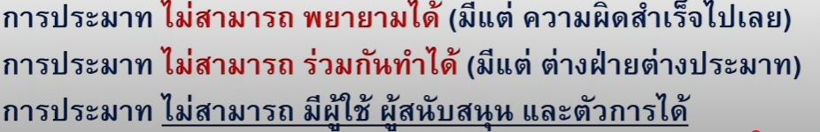

# Basic Law 
### กฏหมาย ( Ubu societas ibijus ที่ไหนมีสังคมที่นั่นมีกฏหมาย )
คือ คำสั่ง ข้อบังคับในสังคมซึ่งอาจมาจาก ศีลธรรม จารีตประเพณี ศาสนาของสังคมนั้น ๆ รวมถึงความคิดเห็นต่าง ๆ ของผู้ทรงความรู้ หรือ ที่เราเห็นได้ชัดเลยคือฝั่ง Eu ที่ใช้คําพิพากษาที่เคยตัดสินไว้ มาเป็นข้อกฏหมายในปัจจุบัน ซึ่งกฏหมายควรจะตั้งอยู่บนหลักความ **ยุติธรรม** 

### ลักษณะของกฏหมาย
#### Mandatory Law ตามเนื้อความ  ex . ประมวล everyThing หรือ พรบ. 
- ต้องเป็นคำสั่งและข้อบังคับเช่น กำหนดกฏเกณฑ์ระหว่าง คนกับคน หรือ คนกับสังคม
- มาจากรัฏฐาธิปัตย์ ซึ่งในไทยก็คือ สภา 
- เป็นคําสั่งที่หรือข้อบังคับที่ใช้ได้ทั่วไปไม่เลือกปฏิบัติ
- กฏหมายต้องสามารถบังคับที่สามารถใช้ได้ตลอดไปจนกว่าจะมีการเปลี่ยนแปลง
- มีภาพบังคับและบทลงโทษ
#### Process Law ตามพิธี
- คล้ายๆ กับข้างบน
- แต่ไม่จำเป็นต้องมีบทลงโทษ หรือบังคับให้คนทั่วไปใช้ 
- ชื่อบอกตามพิธีก็คือใช้เฉพาะ ส่วนที่ต้องการดำเนินกิจการอะไรสักอย่าง เช่น รัฐที่ต้องมี พรบ งบประมาณที่กำหนดการใช้ เงินของรัฐ กระทรวง ทบวง กรม ต่าง ๆ บลาๆ 

### ระบบกฏหมาย 4 หลัก 
- **Civil Law** (Romano Germanic, Codifiend Law, ลายลักษณ์อักษร) มาจาก กรุงโรม Italy ที่ฟื้นฟูกฏหมายโรมันเพื่อแก้ **นิติสัมพันธ์ที่ซับซ้อน** และ Germanic ก็นำมาใช้ต่อ และอื่น ๆ ก็ตามมาเช่น France JP Thai เป็นต้น หลักเลยก็คือข้อกฏหมายแม่ง**มาเป็นประมวล**  

- **Common Law** (กฏหมาย England, แองโกลอเมริกัน, จารีตประเพณี) ไม่เป็นลายลักษณ์อักษร ซึ่งมันจะตัดสินตามสิ่งที่ควรจะเป็นตามความเป็นจริง มาจาก King Wiliam ที่ตั้งศาลหลวงที่วางหลักเกณฑ์โดยใช้การตัดสินที่เคยพิพากษาไปแล้ว มาเป็นกฏหมาย ประเทศที่ใช้ก็ US, Cannada, Austalia, Newsealand
- **Socailist Law** (Communist, สังคมนิยม) **Rusia** เดิม คือ ระบบสมบูรณาญาสิทธิราชย์ (ระบบ King) โดยสโลแกนคือ **เมื่อสังคมเท่าเทียมกัน กฏหมายก็จะหายไป** เกิดขึ้นมาเพราะ นายทุนสามารถคุมได้ทุกอย่างดังนั้นคนรวยเลยสามารถกดคนจนได้ ดังนั้น คาร์มารก (คนๆ นึง) จึงเสนอใช้ กม.เป็นเครื่องมือในนการยึดผลประโยชน์ส่วนรวม โดยที่ทุกคนไม่มีใครเป็นกรรมสิทธิ์ของอะไร ทุกอย่างจะ**ตกเป็นของส่วนกลางหรือส่วนรวมของสังคมเพื่อให้สังคมเท่าเทียมกัน** ประเทศที่ใช้ จีน, N.Korean, Loas, Vietnam (ไม่ค่อยดีเพราะทุกคนไม่ควรได้่เท่ากันทั้งที่ทำไม่เท่ากัน)
- **Religloius Tradition Law** (ศาสนา ประเพณีนิยม) ศาสนามักจะเห็นในกม. ที่เกี่ยวกับ Family Relational เช่น อิสลามที่ว่าด้วยเรื่องของ มรกดครอบครัวตามหลักศาสนา ตัวอย่างคือ 3 จว ภาคใต้ (ขงตื้อ ชินโตที่เกี่ยวกับประเพณีของฝั่งจีนมั้ง)

### วิธีการแบ่งแยกประเภทของกฏหมาย 
#### 1. แบ่งตามลักษณะแห่งการใช้ 
- **กฏหมายสารบัญญัติ** (Substantive Law) คือ กม.ที่บอกถึง**ใครมีสิทธิอะไรและทําหน้าที่อะไรบ้าง**หรือกำหนดความสัมพันธ์ต่าง ๆ เช่น สิทธิในทรัพย์สิน สิทธิในครอบครัว ตัวอย่างกฏหมายก็ ประมวลแพ่ง และ อาญา 
- **กฎหมายวิธีสบัญญัติ** (Procedural Law) คือ กม.บ่งบอกถึงวิธีการบังคับใช้กม. หรือกระบวนการที่จะบังคับใช้ให้เป็นไปตามสารบัญญัติ เอาเข้าใจง่าย ๆ คือ **ทำยังไงถึงจะใช้สิทธินี้ได้ หรือ จะฟ้องต้องทํายังไง** เช่น ประมวลพิจารณาแพ่ง และ อาญา
#### 2. แบ่งตามคู่กรณี 
- **กฎหมายมหาชน** รัฐ vs รัฐ or รัฐ vs ปชช. ซึ่งรัฐจะมีสถานะเหนือกว่าปชช. ในฐานะผู้ใช้อำนาจรัฐ เอาง่าย ๆ ก็แบ่งเป็น 4 แบบตามความสำคัญ คือ   
**รัฐธรรมนูญ** ซึ่งก็ว่าด้วยเรื่องของใครมีอำนาจอะไรหรือ อำนาจอธิปไตยแบ่งเป็นกี่ส่วนใครเป็นประมุข ปชชมีเสรีอย่างไร บลาๆ ,   **กฎหมายปกครอง** ซึ่งว่าด้วยเรื่องของการจัดระเบียบการบริหารประเทศ เช่น กรทรวง ทบวง กรม หรือหน้าที่ของหน่วยงานภาครัฐต่าง ๆ เช่น  Use Case บ่อย ๆ การฟ้องเวนคืนที่ดินของรัฐ,   
**อาญา** เป็นมหาชนเพราะ **รัฐใช้อำนาจปกครองประชาชน** ก็ตามสูตร ประหาร จำ กัก ปรับ ริบ ,    
**วิธีพิจารณาความต่าง ๆ** หรือก็คือวิธีการภายในศาล     
- **กฎหมายเอกชน** เอกชน vs เอกชน รวมถึงหน้าที่และสิทธิของเอกชนที่มี สั่้น ๆ น่ะ **แพ่ง** จบ 

- **กฏหมายระหว่างประเทศ** ก็ความสัมพันธ์ระหว่าง 2 ประเทศขึ้นไปไม่งงน่ะ

### วิวัฒนาการกฏหมายไทย (ใครจำก็จำไม่ใช่กูล่ะ 1 )
#### ช่วงขอแบบสั้น ๆ ซึ่งจะเรียงตามลำดับที่เก่าสุดน่ะจ๊ะ
- ก่อนสุโขทัย = กฏบ้าน กฏเมือง
- สุโขทัย = ธรรมราชา
- อยุธยาค่อนรัตนโกสิน = ตราสามดวง
- รัชกาลที่ 4-5 = civil law เพราะรับอิทธิพลมาจากตะวันตก จบเอาแค่นี้พอ

### ลำดับชั้นกฎหมาย

## อภินิหารอาญา Remake By กูเอง (สไลด์แม่งมั่วตั้วจัด)
### โทษทางอาญา 
#### มาตรา 2 
**ประหาร -> จําคุก -> กักขัง -> ปรับ -> ริบทรัพย์**
### KeyWord
- การกระทำ = ต้องมี 2 อย่าง (3 อย่างตามความเป็นจริง) คือ **จะเคลื่อนไหวหรือไม่เคลื่อนไหวก็ได้** และ**รู้สำนึก**ซึ่ง**อยู่ภายใต้บังคับจิตใจ** เช่น การที่โดนจับมือบังคับให้ทํา หนึ่งมีการเคลื่อนไหว สองรู้สำนึก แต่ไม่ได้อยู่บังคับจิตใจซึ่งก็ไม่ครบเท่ากับ**การกระทำ**
 
 

 

- การกระทําโดยเจตนา = ขยายความมาจากคำว่า **การกระทำ** และต้องประสงค์ต่อผลหรือย่อมเล็งเห็นผลและรู้ข้อเท็จจริงอันเป็นองค์ประกอบความผิด
- การกระทําโดยประมาท = ไม่ระวัง หรือระวังไม่พอ
 

 

 

- การกระทำโดยไม่รู้ข้อเท็จจริง = ขาดเจตนา
- การกระทำโดยงดเว้นการกระทําที่ต้องกระทำเพื่อป้องกันผล = มึงต้องทำแต่มึงไม่ทำ
 

 

- เจตนาประสงค์ต่อผล (ผู้กระทำต้องการให้เกิดผลนั้น) vs เจตนาย่อมเล็งเห็นผล (ผู้กระทำไม่ได้ต้องการให้ผลนั้นเกิดขึ้นแต่เห็นว่าจะเกิดขึ้นแน่นอน เช่น หมั่นไส้จะทําร้ายคนๆ นึงให้บาดเจ็บหรือแค่ขู่ แต่ดันเอาตาย)
### ความรับผิดทางอาญา
  
**โดยจะเรียงเป็น Step ดังนี้** 
1. ต้องมี **การกระทํา**
2. มี **การกระทำโดยเจตนาไหม**

#### มาตรา 59 
มีอยู่ 5 วรรค 
- วรรค 1 จะพูดถึงเราจะได้รับผิดทางอาญาตอนที่กระทำโดยเจตนา หรือ ประมาทจนเกิดเหตุใหญ่ 
- วรรค 2 การกระทำโดยเจตนา ก็คือรู้สำนึกว่าทําเพื่ออะไร
- วรรค 3 การกระทําโดยไม่รู้ข้อเทจจริง
- วรรค 4 การกระทําโดยประมาท
- วรรค 5 การกระทำอันใดอันนึงโดยงดเว้นการกระทําที่ต้องกระทำเพื่อป้องกันผล

#### สรุปรับผิดทางอาญาตอนไหน ? 
- **เมื่อกระทำโดยเจตนา** ถ้ามีกม. บอกว่าเป็นความผิด = ผิด กลับกันถ้าไม่มีกม. บอก = ไม่ผิด
- **เมื่อกระทําโดยประมาท** กม. ต้องบอกว่าผลการกระทำโดยประมาทนั้น ๆ มีความผิดถึงจะรับผิด เช่น ประมาททําให้คนอื่นตุยเยส (ระวังมันคล้าย ๆ กับ เจตนาเล็งเห็นผล) เคส ม. ราม ไอ้รถลื่นฝนตกชนหาบเต้าหู่มันไม่ต้องรับผิดทางอาญาเพราะประมาทก็จริงแต่ทำให้เสียทรัพย์เชย ๆ อาจจะไปทางแพ่งแทน
- **เมื่อการทําโดยไม่เจตนา** (ความผิดเด็ดขาดหรือลหุโทษ) อันนี้ก็ต้องบอกไว้ชัดเจนเหมือนกันเช่น ลหุโทษ ตามมาตรา 102

#### มาตรา 334 (ตัวอย่างการกระทำโดยไม่รับรู้ข้อเทจจริงหรือก็คือขาดเจตนา)
"ผู้ใดเอาทรัพย์ของผู้อื่น หรือที่ผู้อื่นเป็นเจ้าของรวมอยู่ด้วยไปโดยทุจริต ผู้นั้นกระทำความผิดฐานลักทรัพย์ ต้องระวางโทษจำคุกไม่เกินสามปี และปรับไม่เกินหกหมื่นบาท"
##### องค์ประกอบความผิด 
- ผู้ใด 
- เอา
- ไปโดยทุจริต
- ของผู้อื่นหรือผู้อื่นเป็นเข้าของรวมอยู่ด้วย
  

### ฟ้องอาญา 
#### ถ้าเป็นคดีที่ยอมความได้ 
ต้องฟ้องหรือแจ้งความรองทุกข์ภายใน 3 เดือนตั้งแต่วันที่รู้ไม่งั้นคดีจะขาดอายุความ  เช่น 
- ความผิดฐานหมิ่นประมาท (มาตรา 326),
- ความผิดฐานทำร้ายร่างกายเล็กน้อย (มาตรา 391),
- ความผิดฐานลักทรัพย์ในครอบครัว (มาตรา 334 วรรคสอง)
#### ถ้าเป็นคดีที่ยอมความไม่ได้ 
อายุความจะขึ้นอยุ่กับโทษที่ต้องได้รับทางอาญา
- ยี่สิบปี สำหรับความผิดต้องระวางโทษประหารชีวิต จำคุกตลอดชีวิต หรือจำคุกยี่สิบปี

- สิบห้าปี สำหรับความผิดต้องระวางโทษจำคุกกว่าเจ็ดปีแต่ยังไม่ถึงยี่สิบปี

- สิบปี สำหรับความผิดต้องระวางโทษจำคุกกว่าหนึ่งปีถึงเจ็ดปี

- ห้าปี สำหรับความผิดต้องระวางโทษจำคุกกว่าหนึ่งเดือนถึงหนึ่งปี
- หนึ่งปี สำหรับความผิดต้องระวางโทษจำคุกตั้งแต่หนึ่งเดือนลงมา หรือต้องระวางโทษอย่างอื่น
  

